## **Artificial Intelligence II**

### **Exercise 1: Detection of High-Frequency Regions (Edges)**

**Name:** Olympia Tsamou

The objective of this exercise is to detect the edges of the two images shown below using linear **Sobel filters**.
|   |   |
|---|---|
|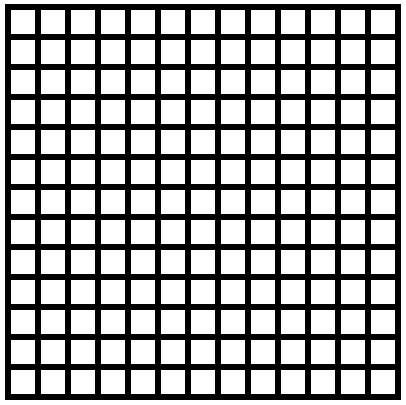||

The programming language used for the image processing is **MATLAB**.

---

### **Gaussian Smoothing Filter 5×5**

The two images are opened as matrices, where each matrix element represents the brightness of the image in **grayscale** [0,255].
To smooth the image, a convolution is performed between the image and a **Gaussian filter** with σ = 5/6.
Applying this filter produces the following images:

|   |   |
|---|---|
|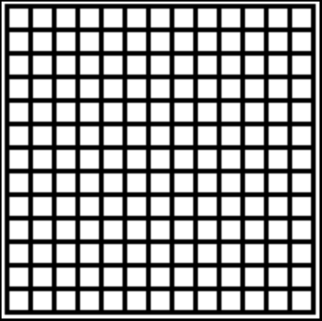||

The images appear blurrier and smoother.
In order to perform the convolution, two rows and two columns with a value of 0 were added to each side of the image, which is why we observe a black border around the result.

---

### **Detection of Horizontal Edges Using a 3×3 Sobel Filter**

To detect horizontal edges in an image, we perform a convolution with the following filter:
$$
G_y =
\begin{bmatrix}
1 & 2 & 1 \\
0 & 0 & 0 \\
-1 & -2 & -1
\end{bmatrix}
$$
Then, for displaying the result, we proceed as follows:

**a. Normalization to the range [0,255]**
|   |   |
|---|---|
|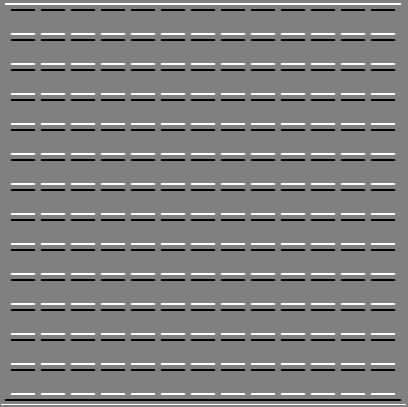|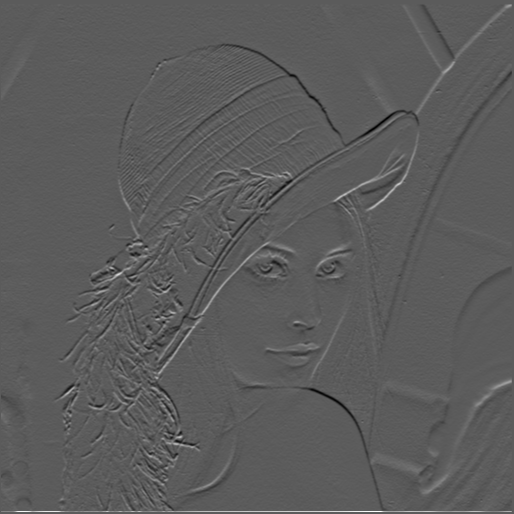|

Points with a larger gradient magnitude are shown in white, and those with the opposite gradient are shown in black.

Results after Gaussian smoothing:
|   |   |
|---|---|
|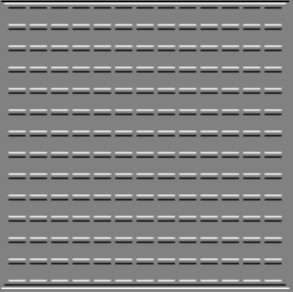|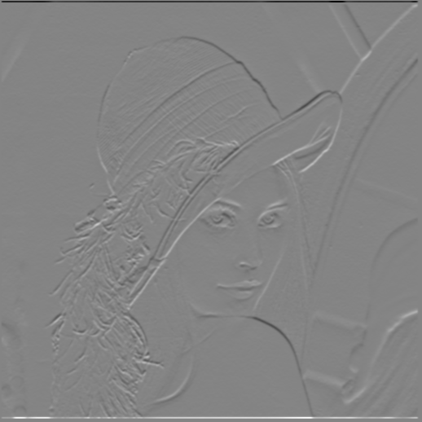|

**b. Normalization by mapping zero gradient to brightness value 0**
|   |   |
|---|---|
|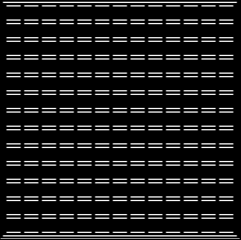|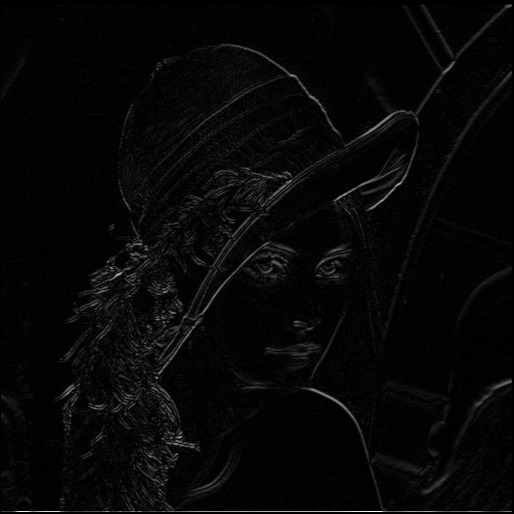|

With smoothing applied:
|   |   |
|---|---|
|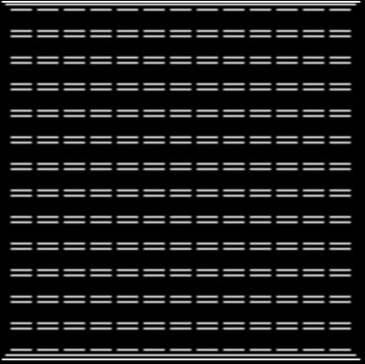|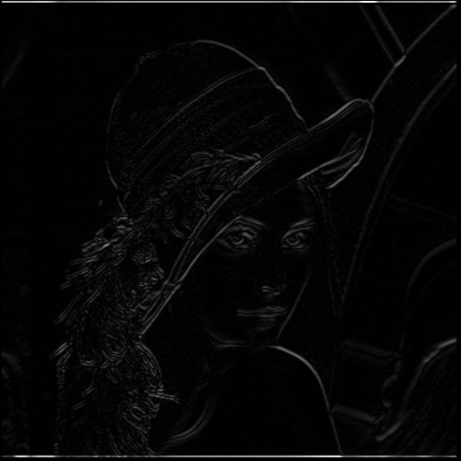|

By taking the **absolute value** of the image matrix and normalizing to [0,255], the edges appear white regardless of their direction.
This result is visually easier to interpret; however, the information about edge direction is lost.
For example, in the *grid* image, we can see two edges for each parallel line of the grid, whereas in the original image we would consider it as one.

---

### **Detection of Vertical Edges Using a 3×3 Sobel Filter**

To detect vertical edges, we follow the same procedure, using the **transposed (or mirrored)** Sobel filter:

$$
G_x =
\begin{bmatrix}
-1 & 0 & +1 \\
-2 & 0 & +2 \\
-1 & 0 & +1
\end{bmatrix}
$$

The results are shown below:
|   |   |
|---|---|
|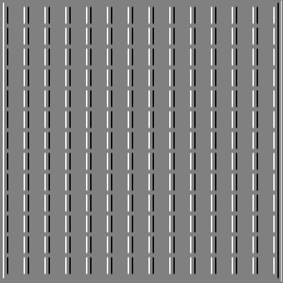|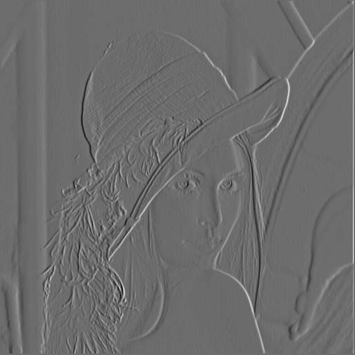|

Normalization at 0:
|   |   |
|---|---|
|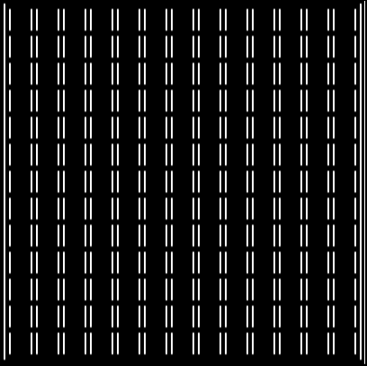|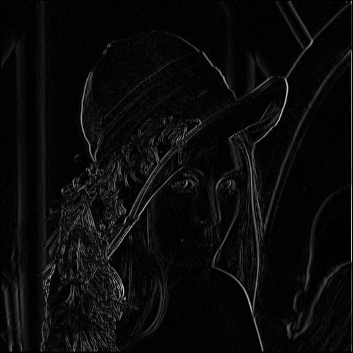|

---

### **Sobel in Any Direction**

After applying the Sobel filter for both horizontal and vertical edges in each image, we compute the **resultant gradient** of the brightness function.
Let **H** be the horizontal component and **V** the vertical component.
The final edge magnitude is computed as:

$$
G = \sqrt{H^2 + V^2}
$$

The resulting images are as follows:
|   |   |
|---|---|
|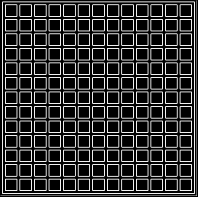|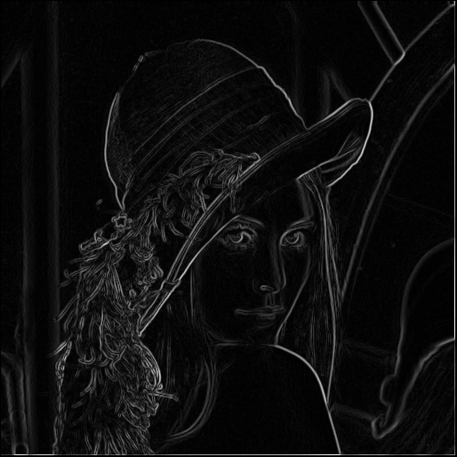|

With Gaussian smoothing:
|   |   |
|---|---|
||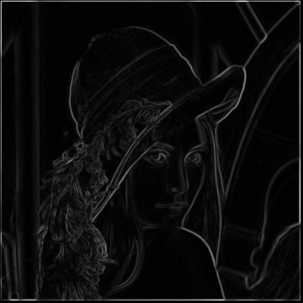|

It can be observed that, with the Gaussian filter, the edges in the second image (*Lenna*) are clearer and more distinct, with less noise caused by small details that can produce strong gradients.

---

### **Edge Significance Thresholding**

A **thresholding operation** is applied to the images, keeping only the brightness values above a specific threshold and setting all others to 0 (black).
This retains the strong object edges and reduces noise.
|   |   |
|---|---|
||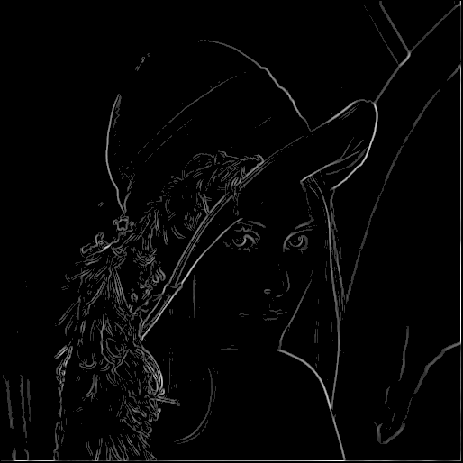|

With Gaussian smoothing:
|   |   |
|---|---|
|||

The threshold does not seem to have a major effect on the *grid* image; however, in *Lenna* we can observe more prominent contours, while fine details have disappeared.
A threshold of **T = 40** was used.

---

